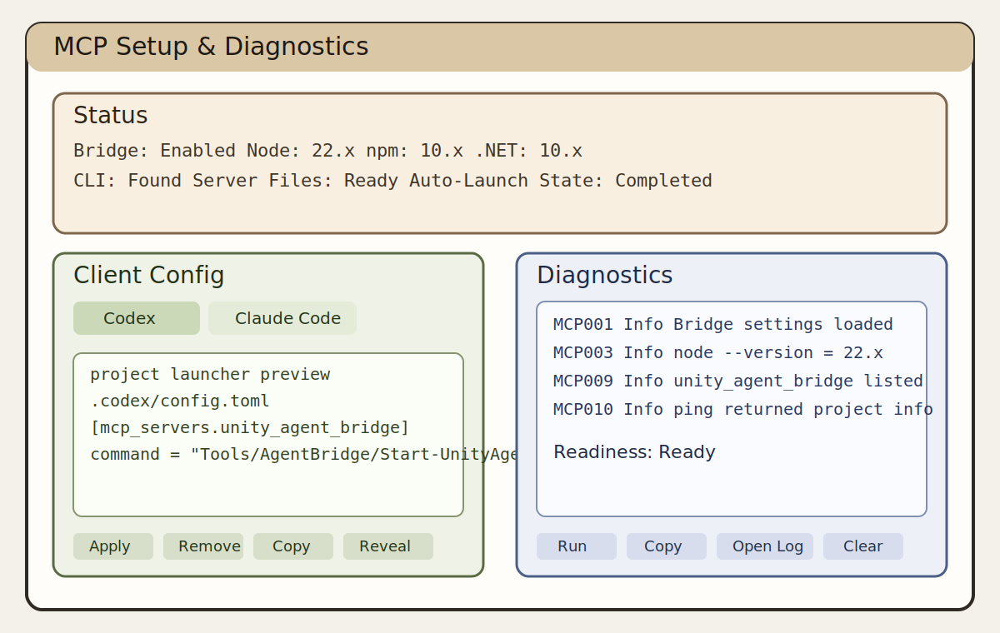
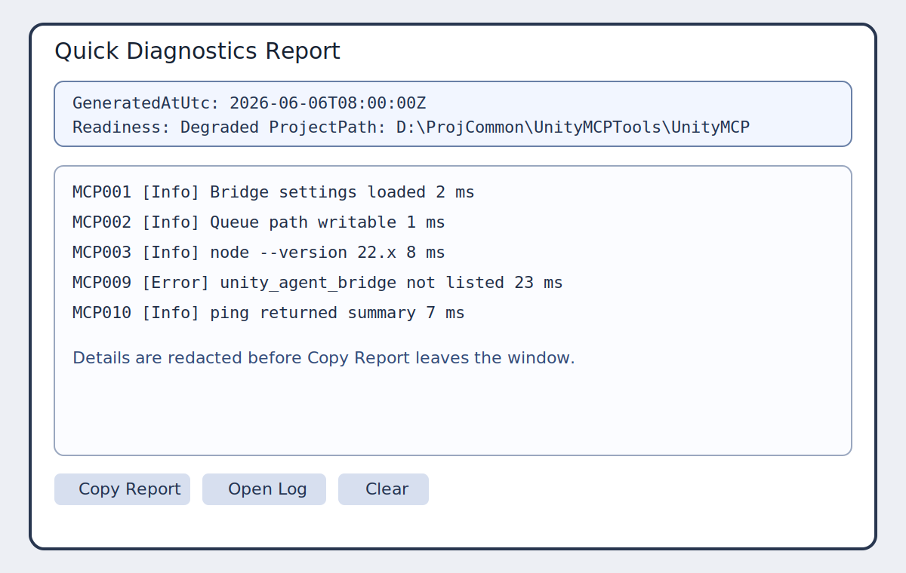

# Integration Guide

## Purpose

`com.unitymcp.agent-bridge` exposes a local, offline Unity Editor automation bridge. The package starts an Editor-side poller, accepts structured commands through a file queue, and returns structured `ToolResult` JSON for agents, CI scripts, the package-contained external CLI, and the optional Editor MCP client flow.

## Prerequisites

- Unity `2021.3+` package compatibility; the current required validation lane is Unity `2022.3.53f1`
- Editor-only package usage; no Player/runtime integration
- Local filesystem access for `Temp/AgentBridge` and `Library/AgentBridge`
- .NET 8 SDK for MCP workflows that build the project-local runtime from the Setup window.
- No cloud dependency and no Unity AI Assistant dependency

## Package Layout

- `Editor/Core/`: queue, facade, poller, protocol, settings, compile/test operation managers
- `Editor/Mcp/`: Editor MCP settings, discovery, process control, client config, diagnostics, and UI
- `Editor/Tools/`: built-in Unity tools
- `Tools~/`: package-contained MCP launchers, runtime build wrappers, and `UnityAgentBridge/src` build inputs
- `../UnityAgentBridge.Cli/`: workspace-root .NET source, tests, and `UnityAgentBridge.Cli.sln` for product development
- `Documentation~/schemas/`: root-level redirect only; not authoritative
- `com.unitymcp.agent-bridge/Documentation~/schemas/`: authoritative package command/result and args schemas

Per-test traceability records are repository verification evidence and are kept outside the package payload under `Documentation~/AgentBridge/test_records/`.

## Five-Minute Setup

### Option A: release-style Git dependency

Add the package to `Packages/manifest.json`:

```json
{
  "dependencies": {
    "com.unitymcp.agent-bridge": "git+https://github.com/mice/unity-agent-bridge.git?path=/com.unitymcp.agent-bridge#v1.2.4"
  }
}
```

Release validation requires package-contained build inputs and runtime build wrappers. Source tags do not include generated Windows executable payloads by default; external projects build the local runtime with .NET 8 SDK from the MCP Setup window.

### Option B: local file dependency during development

```json
{
  "dependencies": {
    "com.unitymcp.agent-bridge": "file:D:/Path/To/com.unitymcp.agent-bridge"
  }
}
```

For the in-repository workbench `UnityMCP` example project, use the relative dependency:

```json
{
  "dependencies": {
    "com.unitymcp.agent-bridge": "file:../../../unity-agent-bridge/com.unitymcp.agent-bridge"
  },
  "testables": [
    "com.unitymcp.agent-bridge"
  ]
}
```

Do not copy the package contents into `Assets/`; consume the package through `Packages/manifest.json`.

## First Editor Run

1. Open the Unity project.
2. Wait for script compilation/import to finish.
3. Open `Edit -> Project Settings -> Agent Bridge`.
4. If no settings asset exists, click `Create Settings Asset`.
5. Leave the default values unless your workspace requires redirected queue/log paths.

Expected result:

- `Library/AgentBridge/logs/bridge.log` contains `bootstrap_completed`
- `Temp/AgentBridge/` is created lazily when the first command is queued

## Plugin Discovery

`v1.2.x` includes a Unity-side plugin discovery loop for tools that should be visible through MCP without hard-coding new MCP catalog entries.

### Plugin SDK dependency

Plugin providers and tools compile against `com.unitymcp.plugin-abstractions`, which owns the `UnityMcp.Plugin.Abstractions` assembly and `UnityMcp.Plugin` namespace. External plugin projects should reference that package instead of referencing Agent Bridge host/editor internals.

During local file or Git dependency development, host projects must make both packages resolvable:

```json
{
  "dependencies": {
    "com.unitymcp.agent-bridge": "file:D:/Path/To/com.unitymcp.agent-bridge",
    "com.unitymcp.plugin-abstractions": "file:D:/Path/To/com.unitymcp.plugin-abstractions"
  }
}
```

This extraction does not define long-term binary compatibility rules for the plugin SDK; early external plugins may need to rebuild as the abstraction package evolves.

### Registration model

Plugin activation is explicit and project-local. Register plugin sources in `AgentBridgeSettings.pluginRegistrations`.

- `AsmdefAssembly`
  - requires `assemblyName`
  - optionally narrows to `providerTypeName`
- `ManagedDll`
  - requires project-relative `dllPath`
  - optionally narrows to `providerTypeName`
- `enabled = false`
  - leaves the registration in the settings asset but disables discovery for that source

The default settings register built-in plugins such as `UnityMcp.BuiltInPlugins.ProjectInfo`, `UnityMcp.BuiltInPlugins.EditorBasics`, and, when ready, `UnityMcp.BuiltInPlugins.RoslynExecution`. ProjectInfo is the plugin-owned project metadata implementation.

### Discovery behavior

- Unity discovers only enabled registrations from `AgentBridgeSettings`.
- Each provider must be marked with `UnityMcpPluginAttribute` and implement `IUnityMcpToolProvider`.
- Built-in tools always win conflicts.
- Later plugin conflicts are rejected deterministically and logged.
- Discovery failures disable only the affected provider or tool; they do not disable the bridge.

### Catalog path and schema rules

Valid plugin tools are exported to:

```text
Library/AgentBridge/plugin-catalog.json
```

Each catalog entry contains:

- plugin identity
- bridge tool name
- MCP tool name
- title and description
- default timeout
- runtime mode and side-effect metadata
- `mayTriggerDomainReload`
- resolved input schema JSON

Schema declarations support:

- inline JSON
- `Assets/...` paths
- `Packages/...` paths
- embedded assembly resources

Unity resolves and validates the declared schema source before exporting the final catalog entry.

### Project metadata tool

The public project metadata MCP tool is plugin-owned: `mcp__unity__project_get_info`, which forwards to `unity.project.get_info`.

- `mcp__unity__project_info` and `unity.project_info` are removed from the default shipped surface.
- They are not aliased to the plugin-owned tool names.
- Existing MCP callers that need project metadata should call `mcp__unity__project_get_info`.
- The CLI `project_info` command remains available and submits `unity.project.get_info`.

## RoslynExecution

`v1.2.2` adds the built-in plugin `UnityMcp.BuiltInPlugins.RoslynExecution`.

- Unity bridge tool: `unity.execute_csharp`
- MCP name: `mcp__unity__execute_csharp`
- input contract: caller submits only the `__Run()` method body through `code`
- runtime mode: Edit Mode only
- side-effect posture: runs trusted local Unity Editor automation and can mutate project state

### Enablement and readiness

Roslyn execution is enabled by default.

The tool is exported only when all of the following are true:

1. `AgentBridgeSettings.asset` sets `roslynExecutionEnabled: 1`
2. the built-in plugin registration for `UnityMcp.BuiltInPlugins.RoslynExecution` remains enabled
3. `Build Local Runtime` has generated:

```text
<UnityProject>/.unitymcp/runtime/UnityAgentBridge/roslyn-execution/out/win-x64/unity-roslyn-compiler.exe
```

If any of those checks fail, Unity plugin discovery does not register `unity.execute_csharp`, and MCP does not expose `mcp__unity__execute_csharp`.

### Runtime build and preparation behavior

`Build Local Runtime` publishes the Roslyn compiler proxy from package-contained source:

```text
Packages/com.unitymcp.agent-bridge/Tools~/UnityAgentBridge/src/UnityAgentBridge.RoslynCompiler/UnityAgentBridge.RoslynCompiler.csproj
```

into the project-local runtime:

```text
<UnityProject>/.unitymcp/runtime/UnityAgentBridge/roslyn-execution/out/win-x64/unity-roslyn-compiler.exe
```

Prepare Runtime validates the generated project-local output and refreshes Agent Bridge discovery so the plugin catalog can immediately reflect Roslyn tool availability without requiring a Unity restart.

### Execution model

Unity owns the generated source envelope. The submitted `code` becomes the body of:

```csharp
private static object __Run()
```

inside a generated `Entry.g.cs`. Unity also generates the fixed `Entry.Run()` wrapper that:

- calls `__Run()`
- serializes successful results into a bounded JSON envelope
- catches ordinary `__Run()` exceptions and returns them through wrapper `error`

Generated source is written only under:

```text
Temp/AgentBridge/RoslynExecution/<invocationId>/Entry.g.cs
```

Generated DLLs are written only under:

```text
.unitymcp/runtime/UnityAgentBridge/roslyn-execution/generated/<invocationId>/
```

Unity loads generated assemblies with `Assembly.Load(byte[])`. The workflow does not require `AssetDatabase.ImportAsset`.

### Metrics phases

The tool reports structured metrics/report output for:

- `executed`
- `validation_failed`
- `proxy_failed`
- `compile_failed`
- `load_failed`
- `execution_failed`
- `timeout`
- `serialization_failed`

Ordinary exceptions thrown inside `__Run()` are expected to remain wrapper-contained and therefore report `phase=executed` with the wrapper `result.value.error` populated. `execution_failed` is reserved for failures in the wrapper/reflection path before a valid wrapper JSON payload can be returned.

## MCP Setup & Diagnostics

The v1.1 Editor workflow is exposed by `Tools -> Unity Agent Bridge -> MCP Setup & Diagnostics`.
The primary setup flow is:

1. `Build Local Runtime`: use .NET 8 SDK and package-contained source to generate runtime executables under the current Unity project `.unitymcp/runtime` directory.
2. `Prepare Runtime`: prepare launchers and validate the generated project-local executable outputs.
3. `Apply MCP Client Config`: write managed client config that points at the prepared project-local launcher.
4. `Verify`: run diagnostics after build, preparation, and config.
5. `Command List`: use the button in Step 4 to open a dedicated window that lists the registered Unity MCP commands, their purpose, runtime mode policy, side-effect classification, and domain reload risk.

The main panel also shows `Workspace Config Target` so you can verify where `.codex/config.toml` and `.mcp.json` will be written. Use `Advanced Details` to adjust `Workspace Root` when the detected target is wrong.
The Step 2 primary action row is intentionally limited to `Apply` and `Remove`.

Important path expectation after `Apply MCP Client Config`:

- Codex project config should point to `<UnityProject>/.unitymcp/runtime/AgentBridge/Start-UnityAgentBridge-Mcp.cmd`
- It should not keep pointing at a stale project-local `Tools/AgentBridge/Start-UnityAgentBridge-Mcp.cmd`
- If Codex still targets the stale `Tools/` launcher, MCP startup can fail before `initialize` even when Unity-side diagnostics are green

Reference screenshots:





Recommended operator flow:

1. Open the window from `Tools -> Unity Agent Bridge -> MCP Setup & Diagnostics`.
2. In `Status`, confirm bridge settings, executable runtime, runtime binding, `.NET 8 SDK`, CLI, and server files.
3. In `Client Config`, choose `Codex` or `Claude Code` and inspect the generated project-level preview before applying changes.
4. Use `Apply` only for project-local config; do not edit user-global Codex or Claude files from this workflow.
5. In `Diagnostics`, run Quick Diagnostics and review `MCP001` through `MCP011`.
6. Use `Copy Report` for a redacted summary and `Open MCP Log Folder` to inspect `Library/AgentBridge/logs/`.
7. In `Command List`, use `Open Command List` to review the command surface before invoking tools from an MCP client. The list is generated from the same descriptor metadata that governs runtime mode blocking.

Operational notes:

- `Readiness: Ready` means normal environment and successful bridge/tool checks.
- `Readiness: Degraded` usually indicates the bridge is disabled or a non-critical client/probe condition failed.
- `Readiness: Unavailable` indicates a critical missing dependency such as the prepared executable runtime payload or local CLI files.
- Auto-launch is opt-in and should remain disabled in batchmode and test environments.

## Manual Ping Verification

Create `Temp/AgentBridge/inbox/test_ping.json` with:

```json
{
  "schemaVersion": "1.0",
  "commandId": "test_ping",
  "tool": "unity.ping",
  "timeoutMs": 5000,
  "createdAt": "2026-06-06T00:00:00Z",
  "args": {}
}
```

Within 5 seconds, expect `Temp/AgentBridge/outbox/test_ping.result.json` with:

- `status = "success"`
- `summary = "pong"`
- `metrics.unityVersion`

## Token-Friendly Result Flow

For high-volume inspection tools, prefer the immediate ToolResult for the next common decision and only read the report when `details` or `followUp` says it is useful.

Typical hierarchy flow:

1. Call `unity.get_hierarchy` with default bounds.
2. Read compact `metrics.nodes[]`, `details`, and `followUp`.
3. If the response is enough, continue with a subtree query or `unity.get_gameobject_component_info`.
4. If `followUp.options[0].tool = unity.read_report` or `details.recommendedRead = true`, read the bounded report slice instead of re-querying Unity broadly.

Example:

```text
unity.get_hierarchy(locator=currentScene)
-> metrics.contractVersion = hierarchy.v2
-> metrics.limit = 150
-> metrics.maxDepth = 4
-> metrics.details.reportPath = Temp/AgentBridge/reports/get_hierarchy_<id>.json
-> metrics.followUp.options[0]
```

Then:

```text
unity.read_report(reportPath=<from details.reportPath>, jsonPointer=/result/nodes, offset=0, limit=100)
```

Compile flow:

1. Call `unity.compile`.
2. If `followUp.recommended = false`, treat the compile as complete and do not call `unity.get_console` just to confirm success.
3. If compile fails or warnings matter, prefer `unity.read_report` on the compile report before requesting console history.

## CLI Integration

The product CLI is a project-local generated single-file binary:

```powershell
$cli = "<UnityProject>\.unitymcp\runtime\UnityAgentBridge\cli\out\win-x64\unity-agent-bridge.exe"
& $cli ping
& $cli project_info
```

The Setup window `Build Local Runtime` button runs the package-contained wrapper:

```powershell
Packages/com.unitymcp.agent-bridge/Tools~/UnityAgentBridge/runtime-build/Build-LocalRuntime.ps1
```

Development source invocation is available for maintainers working from a repository or package source checkout:

```powershell
Push-Location .
dotnet run --project .\UnityAgentBridge.Cli\UnityAgentBridge.Cli\UnityAgentBridge.Cli.csproj -- ping
dotnet run --project .\UnityAgentBridge.Cli\UnityAgentBridge.Cli\UnityAgentBridge.Cli.csproj -- project_info
Pop-Location
```

## MCP Integration

The package-contained MCP build source lives under `Packages/com.unitymcp.agent-bridge/Tools~/UnityAgentBridge/src/`.

The project-local external CLI is generated at:

- `<UnityProject>/.unitymcp/runtime/UnityAgentBridge/cli/out/win-x64/unity-agent-bridge.exe`

Local development flow:

```powershell
Use the MCP Setup window `Prepare Runtime` action to materialize a project-local runtime under `<UnityProject>/.unitymcp/runtime/`, then install dependencies there.
Pop-Location
```

The Editor MCP project-local launchers generated by the package are:

- `Packages/com.unitymcp.agent-bridge/Tools~/AgentBridge/Start-UnityAgentBridge-Mcp.cmd`
- `Packages/com.unitymcp.agent-bridge/Tools~/AgentBridge/Start-UnityAgentBridge-Mcp.sh`

Current repository layout notes:

- package source of truth: `../unity-agent-bridge/com.unitymcp.agent-bridge/` from the workbench root
- example consumer project: `unity-agent-bridge-workbench/UnityMCP/`
- repository acceptance reports: `unity-agent-bridge-workbench/Documentation~/AgentBridge/acceptance/`
- this change does not perform a tag, remote push, registry publish, or public release

The MCP server:

- uses the project-local generated C# MCP host
- launches `unity-agent-bridge[.exe] mcp-server`
- uses `<UnityProject>/.unitymcp/runtime/UnityAgentBridge/cli/out/win-x64/unity-agent-bridge.exe` as the normal path
- reads `Library/AgentBridge/plugin-catalog.json` for dynamic plugin tool exposure
- does not load Unity plugin assemblies directly

`unity_bridge_health` and the MCP probe output should be used to confirm the active path. They report `resolvedCliPath`, `cliMode`, and `cliWarnings`; normal validation should report `cliMode=project-local-runtime`. Any fallback mode must be recorded in the acceptance evidence.

### MCP Session Binding

Current MCP behavior is session-bound by design.

- A Codex or Claude Code session binds `unity_agent_bridge` to one Unity project at launcher/startup time.
- The binding is carried through `UNITY_AGENT_BRIDGE_PROJECT_PATH`.
- `mcp__unity__*` calls in that session continue to target the same Unity project queue until a new client session is started.
- Switching the open Unity Editor project does not hot-switch an existing Codex MCP session.

Operational consequence:

1. Open the target Unity project first.
2. Confirm the bridge is running in that project.
3. Start Codex or Claude Code with the MCP launcher/config bound to that same project.
4. Run `mcp__unity__*` only from that bound client session.

Direct MCP project binding uses:

1. `UNITY_AGENT_BRIDGE_PROJECT_PATH`
2. `Tools/AgentBridge/Start-Codex-With-UnityMcp.json`

If none is supplied, it falls back to the repository example project `UnityMCP/`.

Recommended path:

1. Set `ToolsRoot` in the MCP Setup window for the current Unity project.
2. Apply the project-local Codex or Claude Code config.
3. Use the generated direct MCP launcher from that project-local config.

Managed config rules:

1. The generated `unity_agent_bridge` entry prefers:
   - `Build/AgentBridge-PackageDistribution/Tools/AgentBridge/Start-UnityAgentBridge-Mcp.cmd`
2. If you explicitly set a local `ToolsRoot`, that launcher path is treated as an override and must exist.
3. If the resolved launcher path is missing, managed config persistence fails with `launcher_missing` instead of writing a broken command.
4. If `Configured Project*` is shown in the MCP Setup window, use `Sync` before assuming MCP requests will target the correct Unity project.
5. Managed client config files are written under the configured or detected workspace root instead of blindly using the opened Unity project root. You can set `Workspace Root` explicitly in the MCP Setup window; otherwise the writer walks upward and uses the nearest ancestor that already looks like the MCP workspace root.
6. `Workspace Root` must be the opened Unity project root or one of its first three ancestor directories.
7. Use the MCP Setup window `Build Local Runtime` action to generate runtime executables into `<UnityProject>/.unitymcp/runtime/`, then run `Prepare Runtime`.
8. The prepared runtime must not require `node_modules`, `npm install`, or Node.js execution. Building it requires .NET 8 SDK.
8. If `.codex/config.toml` already contains a standalone `[mcp_servers.unity_agent_bridge]` section, the Codex writer parses the file as TOML, updates only the `unity_agent_bridge` subtree, preserves sibling TOML sections and existing `unity_agent_bridge` child tables such as `tools.*`, and then runs a post-write validation step. If the resulting file still contains residual unmanaged `unity_agent_bridge` content, the write fails with `format_validation_failed`.

This is a current architecture constraint, not a defect in Quick Diagnostics. The cost is session setup discipline when validating multiple Unity projects in the same repository.

### External Repository Troubleshooting

Symptom:

- Unity Editor `Verify` or Quick Diagnostics succeeds
- Claude works
- Codex reports `connection closed: initialize response`

Primary checks:

1. Inspect `<WorkspaceRoot>/.codex/config.toml`.
2. Confirm the managed `unity_agent_bridge` launcher path is:
   - `<UnityProject>/.unitymcp/runtime/AgentBridge/Start-UnityAgentBridge-Mcp.cmd`
3. If it still points at:
   - `Tools/AgentBridge/Start-UnityAgentBridge-Mcp.cmd`
   then Codex is using a stale launcher path and can fail the MCP handshake before returning `initialize`.
4. Re-run `Apply MCP Client Config` from the MCP Setup window to rewrite the managed block.

Secondary check when runtime contains unexpected old files:

1. Inspect `<UnityProject>/.unitymcp/runtime/UnityAgentBridge/cli/`.
2. If `unity-agent-bridge.cs` appears there after a fresh `Prepare Runtime`, inspect project-local overrides such as:
   - `<UnityProject>/Tools/UnityAgentBridge/`
   - MCP settings `ToolsRoot`
3. The supported package-contained runtime source is `Packages/com.unitymcp.agent-bridge/Tools~`.
4. Remove stale local overrides or clear `ToolsRoot`, then run `Prepare Runtime` again.

## Logs and Reports

- Bridge log: `Library/AgentBridge/logs/bridge.log`
- MCP setup log: `Library/AgentBridge/logs/mcp-setup.log`
- MCP diagnostics log: `Library/AgentBridge/logs/mcp-diagnostics.log`
- Metrics snapshot: `Library/AgentBridge/metrics.json`
- Per-command report path: `ToolResult.reportPath`
- Diagnostics backup path for broken `.mcp.json`: `Library/AgentBridge/backups/`

## CI Guidance

- Prefer isolated workspaces per CI job.
- Archive `Library/AgentBridge/logs/`, `Library/AgentBridge/reports/`, and `Temp/EMCP-P*/`.
- Read CLI exit codes from the external CLI contract mapping.
- Do not share `Temp/AgentBridge` across parallel Unity Editor instances.

## Uninstall

1. Remove `com.unitymcp.agent-bridge` from `Packages/manifest.json`.
2. Let Unity reimport.
3. Optionally delete:
   - `Temp/AgentBridge`
   - `Library/AgentBridge`
## Build Delivery Root

如果目标是把当前功能作为可交付产物提供给另一个 Unity 项目，入口不应再直接指向源码仓库根。

运行：

```powershell
pwsh Tools/AgentBridge/Build-PackageDistribution.ps1
```

如果你要一次完成构建并跑静态发布校验，使用：

```powershell
pwsh Tools/AgentBridge/Release-PackageDistribution.ps1
```

之后以以下目录作为交付入口：

```text
Build/AgentBridge-PackageDistribution/
```

其中：

- package dependency 指向：
  - `Build/AgentBridge-PackageDistribution/package/com.unitymcp.agent-bridge/`
- MCP runtime payload 位于：
  - `Build/AgentBridge-PackageDistribution/package/com.unitymcp.agent-bridge/Tools~/`
  - includes:
    - `AgentBridge/Start-UnityAgentBridge-Mcp.cmd`
    - `UnityAgentBridge/runtime-build/`
    - `UnityAgentBridge/src/`
- 交付文档位于：
  - `Build/AgentBridge-PackageDistribution/docs/`
- Build 日志位于：
  - `Build/logs/build.log`

当前发布边界要求 Git UPM release tag 携带构建输入和 runtime-build 脚本，而不是提交生成的 Windows 单文件运行时 payload。外部项目需要安装 .NET 8 SDK，并在 MCP Setup window 中运行 Build Local Runtime 后再运行 Prepare Runtime。`Release-PackageDistribution.ps1` 会产出可验证的交付目录，用于发布前检查和文件型集成。

`Release-PackageDistribution.ps1` 会输出：

- `Delivery root`
- `Package root`
- `Tools root`
- `Docs root`
- `Build log`

如果外部项目无法正确使用 MCP，优先检查：

1. `Packages/manifest.json` 是否引用：
   - `Build/AgentBridge-PackageDistribution/package/com.unitymcp.agent-bridge/`
2. `ToolsRoot` 是否指向：
   - `Build/AgentBridge-PackageDistribution/package/com.unitymcp.agent-bridge/Tools~/`
3. `Tools/AgentBridge/Start-Codex-With-UnityMcp.json` 中的 `unityProjectPath` 是否绑定到目标 Unity 项目
4. `Build/logs/build.log` 是否显示 `tools copy` 和 `final validation` 成功

如果外部项目验收仍然回退到源码路径：

- `com.unitymcp.agent-bridge/`
- `Packages/com.unitymcp.agent-bridge/Tools~/`

则不满足 package distribution 的最终交付标准。
